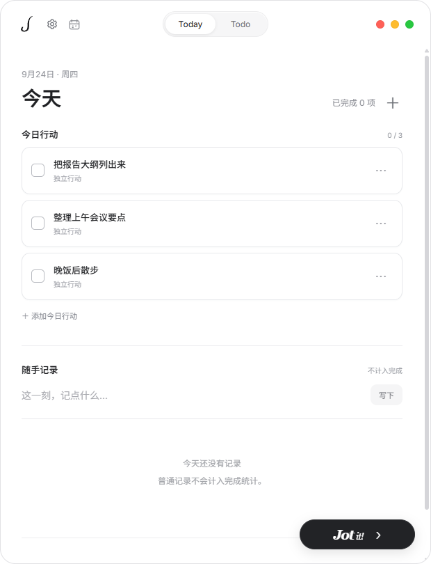
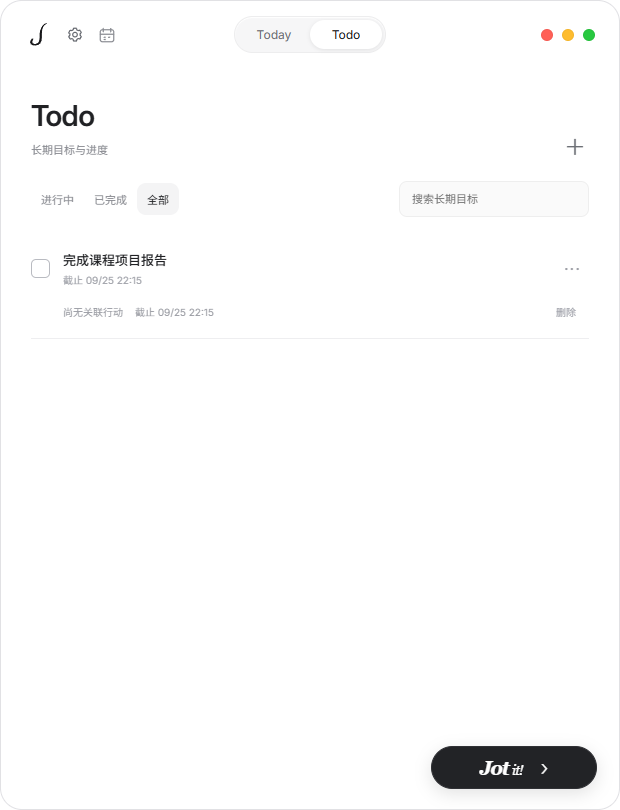

<p align="center"></p>

# Jot

<p align="center">一个安静的桌面 Todo Agent。今天做什么、长期想做什么、已经做了什么，各有位置。</p>

<p align="center"><a href="#界面">看界面</a> · <a href="#下载和使用">开始使用</a> · <a href="#english">English</a> · <a href="https://github.com/cenzihan/Jot">GitHub</a></p>

Jot 目前是 Windows 预览版，界面默认中文。它不附带 AI 额度，也不需要注册 Jot 账号。**手动管理开箱即用；接入自己的模型后，它会成为能直接管理事项的 AI 助手。**

## 为什么做 Jot

普通待办容易越记越长：今天临时要做的小事、长期目标和已经完成的事挤在同一张表里。Jot 把它们分开：

| 放在哪里 | 适合记什么 |
| --- | --- |
| **Today** | 今天的一步行动，以及不需要打勾的随手记录。 |
| **Todo** | 需要慢慢推进的长期目标，可设截止时间。 |
| **完成日志** | 真正完成的事项和简短统计。 |

Today 可以关联 Todo，但勾掉今天的一步，不会自动宣告整个长期目标完成。普通记录也不会冒充“已完成”。

## 界面

下面是 **Jot 运行时的真实截图**，使用隔离的演示数据，不含个人记录或 API Key。

**Today + AI 对话：问一句“今天先做哪件事？”，Jot 结合记录给出建议。**图中的回复来自隔离测试使用的演示模型，不代表内置 AI 服务。


**Today：行动与普通记录分区，完成一小步会留下记录。**



**Todo：长期目标独立保留，不被今天的琐事淹没。**



## AI 能帮什么

接入你自己的模型接口后，可以直接对 Jot 说：

> “明天要交课程报告，放到 Todo。今天先把大纲列出来，完成后写下我做了什么。”

Jot 会把长期目标和今日行动放在各自的位置；需要修改记录时立即更新，并给出撤销机会。对话是侧栏，不会挡住清单。你可以选择模型、配置 System Prompt，并在记忆卡里留下稳定偏好或主动生成近期摘要。

模型只拿到 Jot 限定的记录管理工具，不会获得任意电脑操作权限。AI 回复可能出错；请核对重要日期和事项。

## 能做什么

- 日历按日、周、月查看事项；完成日志回看进度。
- 和 Jot 对话，新增、修改或完成 Today、Todo 和记录。修改立即生效，并可撤销。回复支持流式显示。
- 使用你自己的 OpenAI 兼容或 Anthropic 接口；对话模型、语音识别分别配置。设置改变后自动保存。
- 用记忆卡保存你确认过的偏好；近期摘要只在你主动点击时生成，可以编辑或撤销。
- 点击或按快捷键录音，先检查识别文字，再决定是否发送。也支持本地 whisper.cpp。
- 默认是安静、可拖动的黑白胶囊；也可导入兼容的 Codex Pet 外观。

AI 只能使用 Jot 提供的记录管理工具，不能执行电脑命令。它不会自动读取所有本地 Agent 记录；你必须在设置中明确启用来源，汇总结果也先作为草稿。

## 下载和使用

在 [Releases](https://github.com/cenzihan/Jot/releases) 下载 Windows 压缩包，**解压整个文件夹**，运行里面的 `Jot.exe`。不要只把 exe 单独移走。安装包目前未签名，Windows 可能显示发布者未知。

第一次使用：打开设置，填入你自己的对话 API 地址、模型和 Key。没有配置 AI 也能手动管理事项；语音功能需要另配语音服务或本地 Whisper。

快捷键：`Ctrl + Shift + J` 打开面板；`Ctrl + Shift + Space` 开始或停止语音。聊天框中 `Enter` 发送，`Shift + Enter` 换行。

## 数据和隐私

记录保存在本机 `%APPDATA%\Shiban`，这是旧版沿用的数据目录。Key 在本机加密保存，不写进项目源码或导出文件。若使用云端模型、云端听写，或主动启用 Agent 来源汇总，相应内容会发送到你配置的服务商。Jot 没有自有云同步服务。

导出的记录仍可能包含私人内容，**不要提交到 GitHub**。从旧版升级会保留数据并建立迁移备份；回退旧版前请先备份当前数据。

## 开发

需要 Windows 和 Node.js 24+：

```powershell
npm ci
npm start
```

验证和打包：`npm test`、`npm run test:ui`、`npm run package`。数据结构与模型接口见 [docs/API.md](docs/API.md)，供开发 Agent 使用的约定见 [AGENTS.md](AGENTS.md)。源码采用 [MIT License](LICENSE)；第三方字体和宠物素材仍遵循各自许可。

---

## English

**Jot is a quiet Windows Todo agent.** It gives today's small actions, long-term goals, and completed work separate places to live.

| Place | What belongs there |
| --- | --- |
| **Today** | Actions for this day and quick notes that do not need a checkbox. |
| **Todo** | Long-term goals with optional deadlines. |
| **Completion journal** | Work you actually finished, with simple statistics. |

A Today action can link to a Todo, but completing the action does not complete the whole goal. Ordinary notes do not count as completed work. The screenshots above show the running app with isolated demo data, not personal records.

The optional AI chat can manage Jot records through limited tools, with immediate changes and undo. It cannot run arbitrary computer commands. You configure your own OpenAI-compatible or Anthropic provider; chat and speech recognition use separate settings. A memory card keeps preferences you confirm and a short recent summary you generate only on request. Settings save automatically. Voice transcripts are editable before sending. Jot can also use local whisper.cpp and import compatible Codex Pet skins.

Download the Windows package from [Releases](https://github.com/cenzihan/Jot/releases), extract the **entire** folder, and run `Jot.exe`. The package is currently unsigned. You can use Today, Todo, and the journal without configuring AI; cloud features require your own provider and credentials.

Your records live locally in `%APPDATA%\Shiban`. Cloud chat, transcription, or explicitly enabled agent-log summaries send the relevant content to your chosen provider. Never commit runtime data or exported records. For development on Windows with Node.js 24+, run `npm ci`, `npm start`, and `npm test`. See [API documentation](docs/API.md) and [agent notes](AGENTS.md). MIT licensed; third-party assets retain their own licenses.
