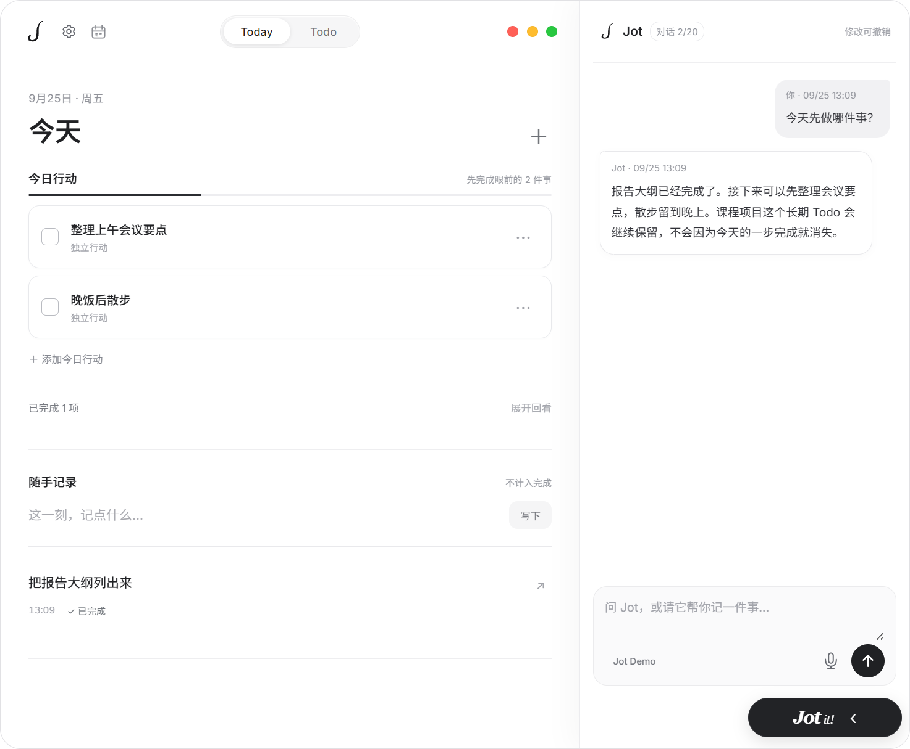
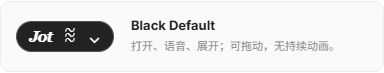

# Jot - Minimal ToDo Agent

A minimal Todo agent that turns everyday progress into a journal with AI.

   

<a href="README_CN.md">中文</a> · <a href="https://github.com/cenzihan/Jot/releases">Download</a> · <a href="docs/API.md">API docs</a>

Jot is a minimal Windows desktop Todo agent. It stays as a small, draggable capsule until you need it. Open it to plan your day, keep longer-term Todos, or talk to an AI that can help organize both. **The journal grows from completed actions**, so you can look back on your work without maintaining a separate log by hand.

## ✨ Why Jot?

Most Todo apps ask you to spend time organizing the list itself. Jot keeps the structure light: **Today** is for the next small step, **Todo** is for work that takes longer, and the **journal** remembers what you finished.

You can add and check off items yourself, or simply tell Jot what happened. With a model connected, Jot can turn a conversation into Today actions, Todos, and completion records, then **show you what changed with an undo option**. A Today action can relate to a Todo without making the long-term goal disappear when one step is done.

## What you can do

- 📅 **Today and Todo, each in its place.** Keep short-term actions away from longer-term plans. Add planned dates and optional deadlines; see scheduled items in the day, week, or month calendar.
- 📓 **A journal that follows your work.** Completed actions appear in the journal with simple counts. Add a completion note when you want more context. Ordinary quick notes remain separate from completed work.
- ✨ **AI that helps with the organizing.** Connect your preferred OpenAI-compatible or Anthropic model, choose a model and prompt style, and manage records through a streaming conversation. You can also choose local Codex, Claude, or other supported agent records for AI summaries.
- 🎙️ **Voice when typing is inconvenient.** Speech recognition has its own configuration. Review and edit the transcript before sending it to chat.
- 🖤 **A calm desktop presence.** The Black Default capsule is small and still. Open it with a click or shortcut, switch to a white capsule, or import a compatible Codex Pet skin.

## 🚀 Get started

1. Download the Windows package from [Releases](https://github.com/cenzihan/Jot/releases), extract it, and run `Jot.exe`.
2. Start using Today and Todo immediately. To use the agent, add your API address, key, and model in Settings. Speech recognition is configured separately.
3. Press `Ctrl + Shift + J` to open Jot, or `Ctrl + Shift + Space` to start or stop voice input.

## Development

`src/` contains the app, `assets/` its visual assets, `docs/` the API guide and screenshots, and `test/` the tests. On Windows with Node.js 24+, run `npm ci` and `npm start`; use `npm test` and `npm run test:ui` to verify changes. See [API docs](docs/API.md) for the record and agent interfaces and [AGENTS.md](AGENTS.md) for contributor guidance.

Jot stores records locally and uses the provider you configure for AI features. Source code is available under the [MIT License](LICENSE).
